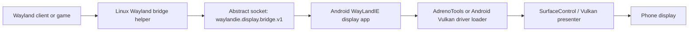

# Architecture

WayLandIE separates display from workload.

The Android app is the display side. The Linux runtime is the workload side.
The Linux process may live in Termux native, proot, chroot, LXC, or an optional
Droidspaces container.



## Core Contract

- The Android app presents buffers.
- The Linux helper hosts the Wayland-facing side and speaks to the Android app.
- The bridge is named for what it does, not for one container implementation.
- Droidspaces is just one backend adapter.
- The intended fast path is dmabuf/Vulkan presentation with no final CPU copy.

## Important Runtime Names

```text
Android package: io.waylandie.display
Activity:        io.waylandie.display/.MainActivity
Bridge socket:   waylandie.display.bridge.v1
APK output:      android-app/out/waylandie-display-mvp.apk
```

## Backend Boundary

Backend adapters install packages and explain environment-specific setup. They
do not change the bridge protocol:

- `termux-native`: direct Termux package environment.
- `proot`: Debian or Ubuntu under `proot-distro`.
- `chroot`: rooted Linux rootfs with Android device access bind-mounted.
- `lxc`: container with Android GPU/device access passed through.
- `droidspaces`: compatibility adapter for the original test environment.

## Steam Boundary

Steam is optional. The Steam tools do not replace Steam. They:

- install a per-game launch wrapper,
- edit Steam Launch Options through `localconfig.vdf`,
- keep launches on Steam-supported AppID paths,
- apply profiles for DXVK, Turnip, FEX, MangoHud, NTSYNC, and Qualcomm driver experiments.
